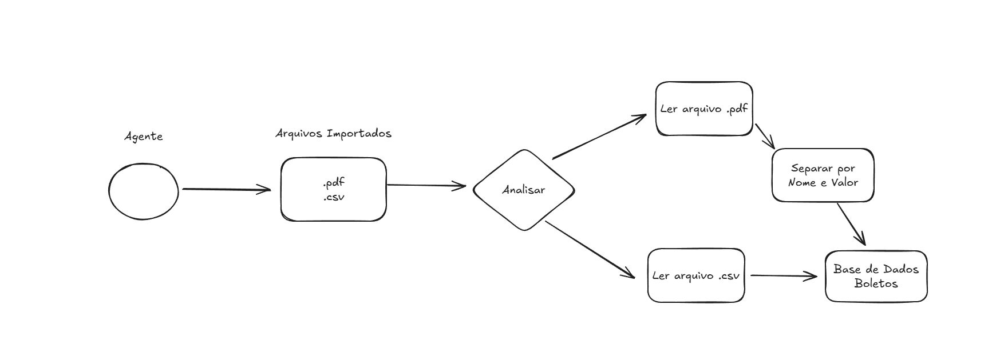

# Introdução

Projeto consiste em ler arquivos enviados de .csv e .pdf e envia-los para uma base de dados, organizando os arquivos conforme a organização. Ilustrando como clientes que possuem nome e um valor de boleto à pagar.

Para isso foram criado três endpoints que possuem métodos diferentes.

## Solução

O arquivo dist/main.ts é o arquivo principal da aplicação, onde ele pasicamente vai ler a rota api trazida de outro arquivo em routes uploads e abrir as rotas na porta 3000, ao rodar o projeto em Node.js.

Arquivo uploads.ts possue as três rotas de endpoint da aplicação com os endereços:

- HTTP - POST: /upload_csv
- HTTP - POST: /upload_pdf
- HTTP - GET: /boletos

## Funcionamento do projeto

O projeto foi feito em um container docker. Executar dockerfile ou configura-lo para rodar localmente.

O projeto já possui dois arquivos de testes ficticios para o teste em:

| assets \
---| files \
-----| csv/pdf

### Banco de Dados

Config arquivo .env

- Caso Docker:
  DATABASE_URL="mysql://`<usuario>`:`<senha>`@host.docker.internal:3306/`nome_do_banco`"
- Caso localmente
  DATABASE_URL="mysql://`<usuario>`:`<senha>`@localhost:3306/`nome_do_banco`"

Migrar os modelos criados pelo Prisma para a base de dados:

```
npx prisma migrate deploy
```

## Tecnologias

- [Prisma](https://www.prisma.io/docs): Solução ORM para banco de dados relacionais
- [Typescript](https://www.typescriptlang.org/): linguagem JS fortemente tipada.
- [Express](https://expressjs.com/pt-br/): Framework Node.js para criação de APis e Middlewares.
- [Multer](https://www.npmjs.com/package/multer): Middleware Node.js para suportar fazer upload de aqruivos em "multipart/form-data".
- [csv-parse](https://www.npmjs.com/package/csv-parse): Manipulação de dados csv.
- [pdf-parse](https://www.npmjs.com/package/pdf-parse): Manipulação de dados pdf.
- [tsx](https://www.npmjs.com/package/tsx): Compilar Typescript em Node.js.
- [Node.js](https://nodejs.org/pt): Ambiente JS Multi-Funcionalidade.

## API HTTP para as requisições.

/upload_csv

```
curl -X POST http://localhost:3000/api/upload_csv
-H "Content-Type: multipart/form-data"
-F "file=@assets/files/csv/teste.csv"
```

/upload_pdf

```
curl -X POST http://localhost:3000/api/upload_pdf
-H "Content-Type: multipart/form-data"
-F "file=@assets/files/pdf/teste.pdf"
```

/boletos

```
curl "http://localhost:3000/api/boletos?client_name=marcos&id_lots=6&active=true"
```


